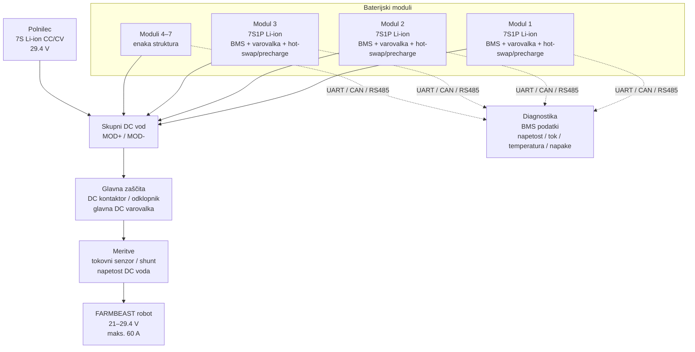
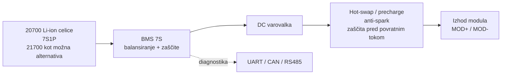

# FARMBEAST – Blokovni diagram baterijskega sistema

Diagram prikazuje osnovno arhitekturo modularnega baterijskega sistema. Namenjen je razumevanju sistema, ne pa natančni električni shemi.

## Pregled sistema

## Notranja zgradba enega modula

