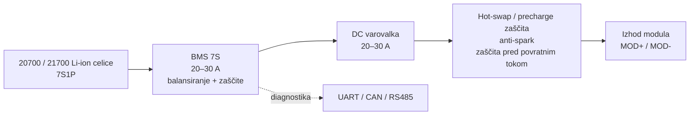

# FARMBEAST – Blokovni diagram baterijskega sistema

Diagram prikazuje osnovno arhitekturo modularnega baterijskega sistema. Namenjen je razumevanju povezav med baterijskimi moduli, skupnim DC vodom, zaščito, polnjenjem, diagnostiko in robotom.

To ni natančna električna shema.

## Pregled sistema

## Notranja zgradba enega modula

