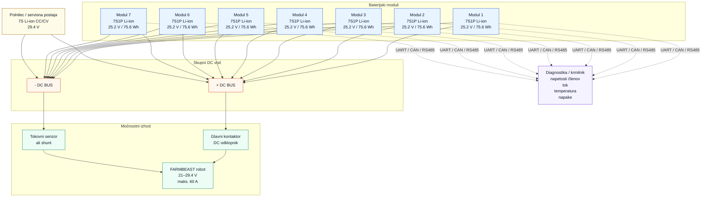
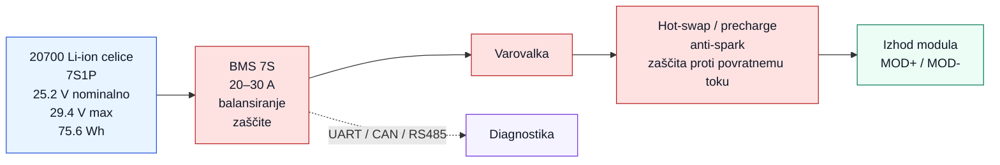

# FARMBEAST – Blokovni diagram baterijskega sistema

Ta dokument vsebuje poenostavljen Mermaid diagram modularnega baterijskega sistema. Diagram je namenjen prikazu arhitekture sistema, ne pa natančni električni shemi.

## Pregled sistema

## Notranja zgradba enega modula

