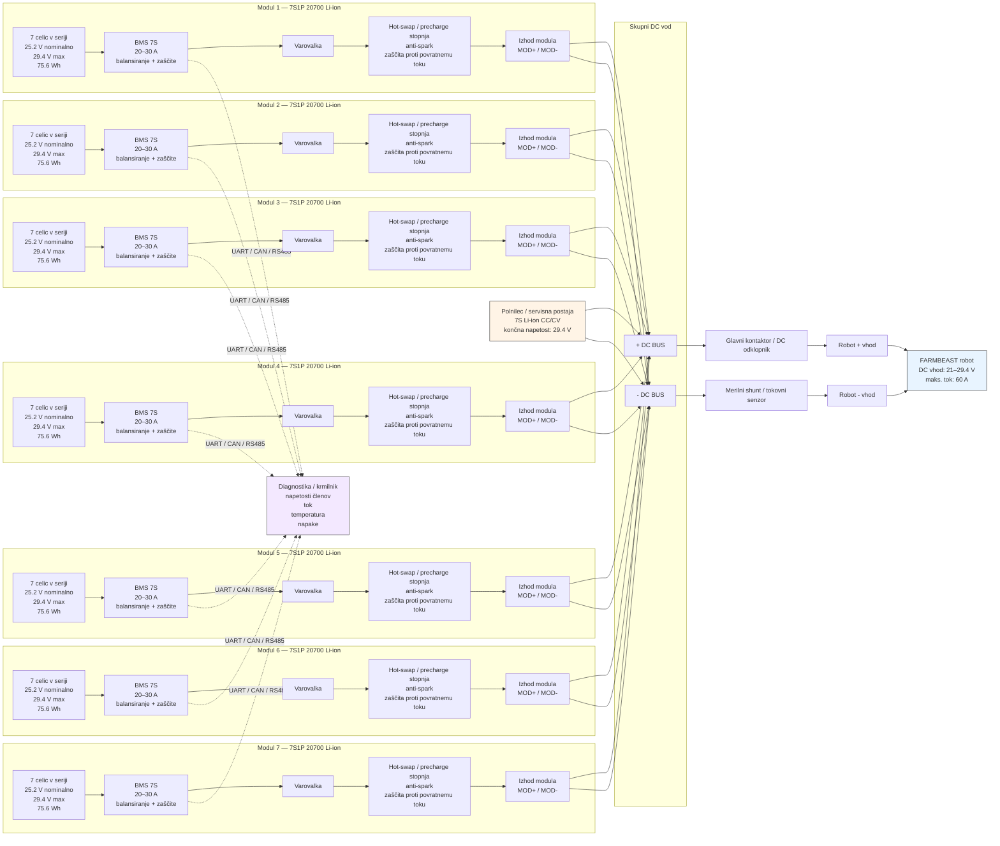

# FARMBEAST modularni baterijski sistem

Spodnji diagram prikazuje vseh 7 baterijskih modulov kot samostojne 7S1P enote. Vsak modul ima svoj BMS, varovalko, hot-swap/precharge stopnjo in izhod na skupni DC vod.

## Opomba

To je konceptni blokovni diagram. Ni prava električna oziroma PCB shema. Za dejansko izvedbo je treba izbrati konkretne komponente: BMS, varovalke, konektorje, kontaktor, precharge upor, MOSFET/ideal-diode hot-swap stopnjo, merilnik toka in komunikacijski vmesnik.